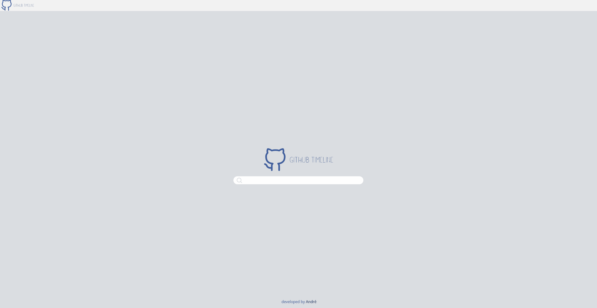

# GitHub Timeline
Generate a timeline of a users GitHub Repos

GitHup Timeline accepts a GitHub user name and produce a timeline containing each repo and annotated with the repo names, the date they were created, and their descriptions.

Based on [app-ideas](https://github.com/florinpop17/app-ideas/blob/master/Projects/3-Advanced/GitHub-Timeline-App.md)

## Demo
Demo is available at [https://andresantos.pt/githubtimeline](https://andresantos.pt/githubtimeline)

## Contributing

There are many ways in which you can participate in this project:
- Submit issues with bugs / new features
- Contributing directly to the code base

